# 🧾 BillingApp

A modern offline-first Billing & POS application built using **React Native**, **Expo**, **TypeScript**, and **SQLite**. The app allows users to manage products, generate bills, print receipts via Bluetooth thermal printers, and maintain billing history without requiring an internet connection.

---

## ✨ Features

- 📦 Product Management
- 🛒 Normal Billing
- ⚡ Quick Billing
- 🧾 Bill History
- 🖨️ Bluetooth Thermal Printing
- 🔄 Auto Print Support
- 📄 Receipt Preview
- 📑 PDF Receipt Generation
- 💾 Offline SQLite Database
- ⚙️ Store Settings
- 🔗 Bluetooth Printer Management

---

## 📱 Screenshots

| Dashboard | Products |
|-----------|----------|
| 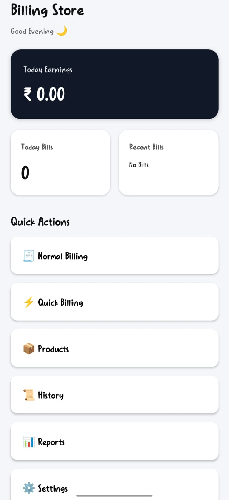 | 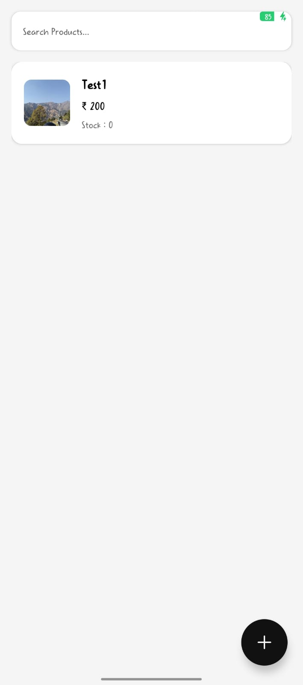 |


|                                        |  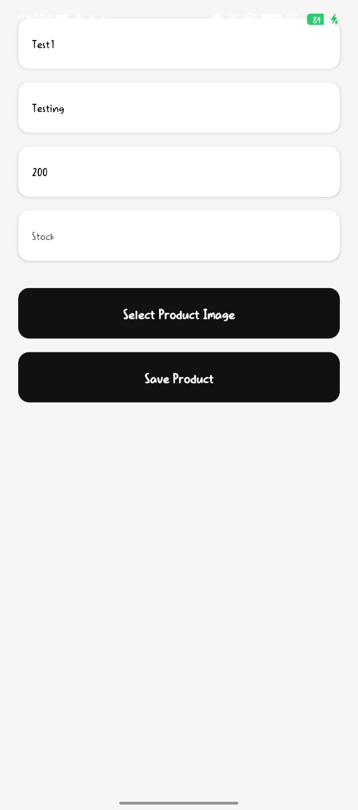 |

| Billing | History |
|----------|---------|
| 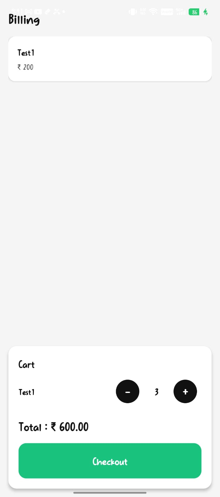 | 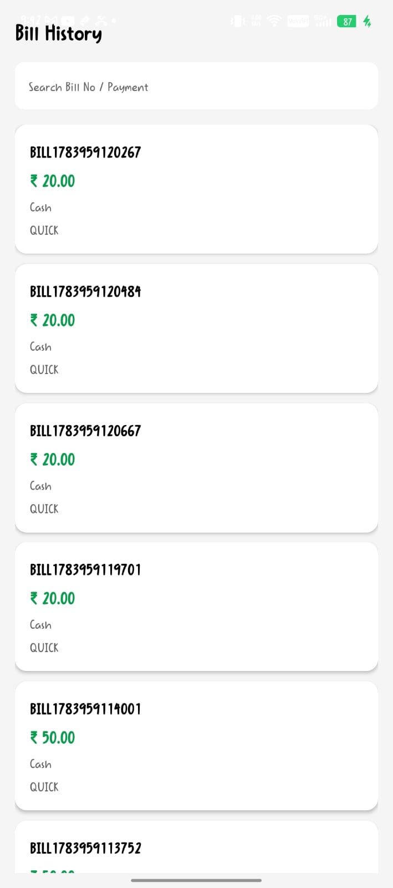 |


| 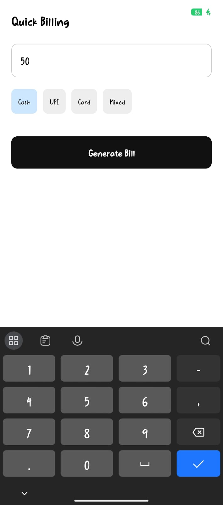 | 

| Reports | Recipt |
|----------|---------|
| 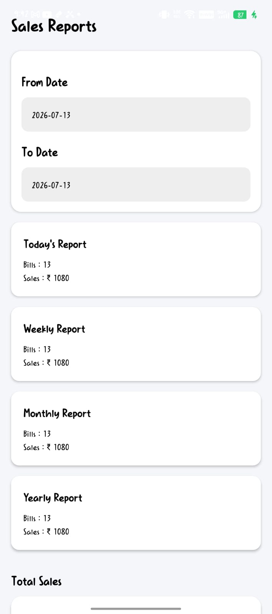 | 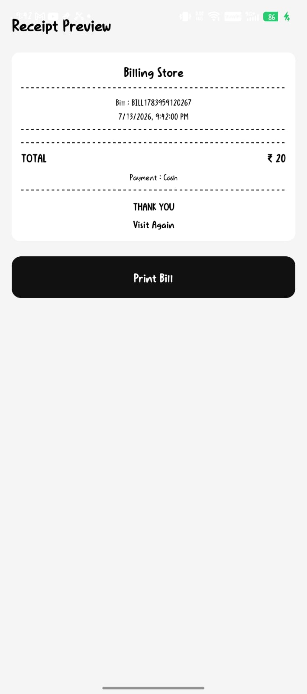 |


| 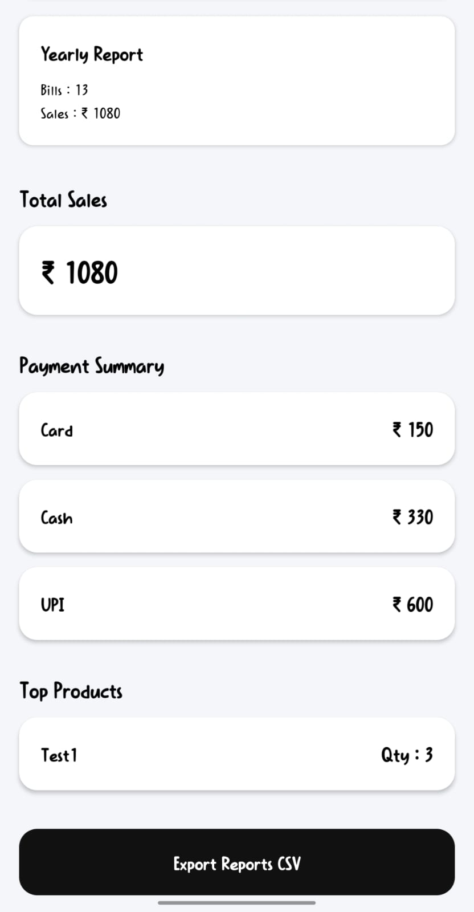 | 

| Settings | about |
|----------|---------|
| 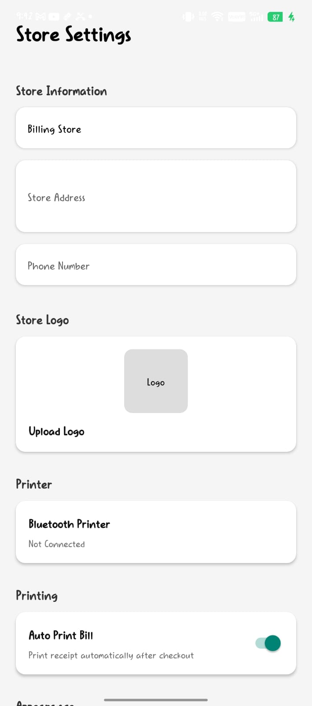 | 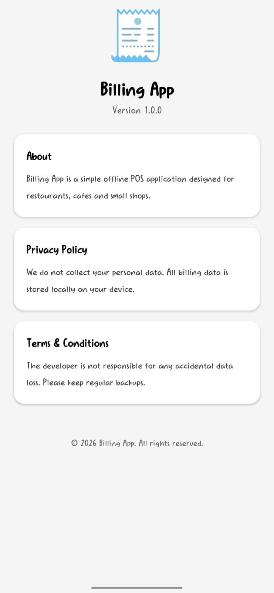 |


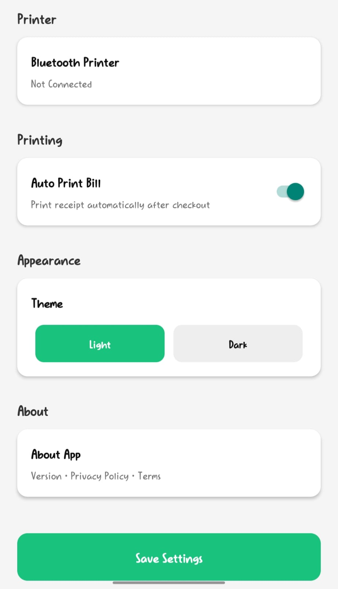 |

---

## 🛠️ Tech Stack

- React Native
- Expo SDK 54
- TypeScript
- Expo Router
- Expo SQLite
- AsyncStorage
- React Native Bluetooth Classic
- Expo Print
- Expo Sharing

---

# 📂 Project Structure

```
BillingApp/

├── app/
├── assets/
├── components/
├── database/
├── services/
├── screenshots/
├── package.json
└── README.md
```

---

# 🚀 Getting Started

## 1. Clone Repository

```bash
git clone https://github.com/ykcodehub/Billing-Application.git

cd BillingApp
```

---

## 2. Install Dependencies

```bash
npm install
```

or

```bash
npm install --legacy-peer-deps
```

---

## 3. Start Development Server

```bash
npx expo start
```

---

## 4. Run on Android

```bash
npx expo run:android
```

---

## 5. Build APK

```bash
eas build -p android --profile preview
```

---

# 📦 Required Permissions

Android permissions used:

- Bluetooth
- Bluetooth Scan
- Bluetooth Connect
- Location (for Bluetooth discovery)

---

# 📌 Current Features

- Offline Billing
- Product CRUD
- Bill History
- Receipt Preview
- Bluetooth Printer Connection
- Auto Print
- Quick Billing
- PDF Receipt
- Store Settings

---

# 🔮 Future Improvements

- GST Support
- Barcode Scanner
- Customer Management
- Sales Reports
- Cloud Backup
- Dark Theme
- Logo Printing on Thermal Receipt

---

# 👨‍💻 Author

**Yogendra Katuwal**

Bachelor of Technology (Computer Science & Engineering)

---

## ⭐ Support

If you found this project useful, consider giving it a ⭐ on GitHub.
